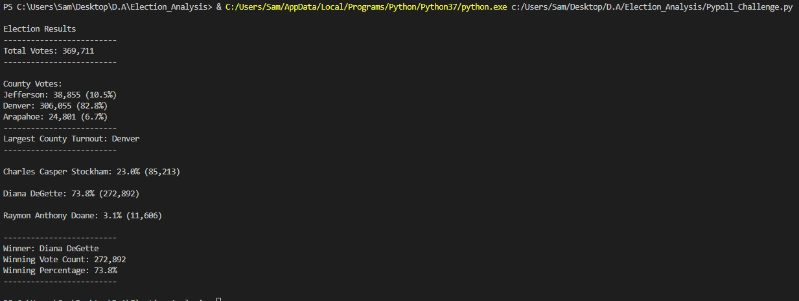

# Election_Analysis

## Overview

The election result data that is analyzed has 3 fields: ballot ID, the county of the voter, and the candidate for which the vote was cast. The purpose of this analysis is to determine the winning candidate of the election with exact vote counts and percentages of their vote with respect to the total vote; the exact vote counts of the counties and their respective percentages of the total vote will be used to determine the county which had the highest amount of votes. These results are saved to "election_analysis.txt" and displayed to the terminal as shown in "terminal.png". 

## Election Audit Results

* There were 369,711 total votes
  * By Candidate
    * Charles Casper Stockham had 85,213 votes or 23.0% of total votes cast
    * Diana Casper Stockham had 272,892 votes or 73.8% of total votes cast, securing her a victory
    * Raymon Anthony Doane had 11,606 votes or 3.1% of total votes cast
  * By County
    * Arapahoe had 24,801 votes or 6.7% of total votes cast
    * Denver had 306,055 votes or 82.8% of total votes cast
    * Jefferson had 38,855 votes or 10.5% of total votes cast

## Election Audit Summary
